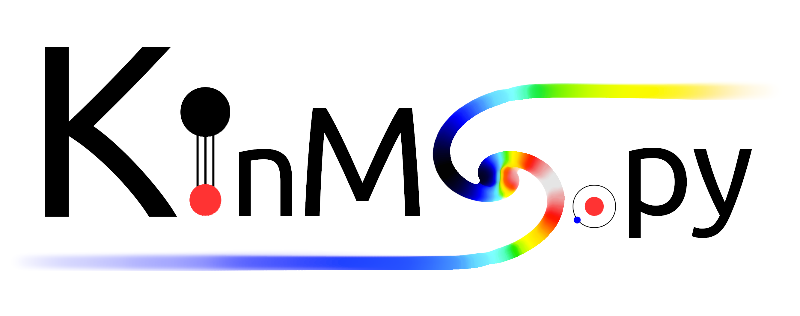

[](https://kinmspydocs.readthedocs.io/en/latest/?badge=latest) [](https://www.python.org/downloads/release/python-360/) [](https://badge.fury.io/py/kinmspytest) 

The KinMS (KINematic Molecular Simulation) package can be used to simulate observations of arbitary molecular/atomic cold gas distributions. The routines are written with flexibility in mind, and have been used in various different applications, including investigating the kinematics of molecular gas in early-type galaxies ([Davis et al, MNRAS, Volume 429, Issue 1, p.534-555, 2013](https://academic.oup.com/mnras/article/429/1/534/1022845)), and determining supermassive black-hole masses from CO interfermetric observations (Davis et al., Nature, 2013). They are also useful for creating input datacubes for further simulation in e.g. [CASA](https://casa.nrao.edu/)'s sim_observe tool.

To run the test suite, which demonstrates some of the functionality of this code, please checkout/download the code, and navigate to the directory. Then:
```
ipython
from KinMS_testsuite import *
run_tests()
```

KinMS_testsuite.py contains the example code, which can be modified and updated for most use cases. If you want to use KinMSpy for fitting, see [KinMSpy_MCMC](https://github.com/TimothyADavis/kinmspy_mcmc) for an example of interfacing with Bayesian fitting codes.

Many thanks,

Dr Timothy A. Davis, Nikki Zabel, and James M. Dawson

Cardiff, UK

---

## Python First    

KinMSpy is designed with Python users in mind. Lots of work has gone into making it lightweight and fast. You can use it in the same way that you would use [NumPy](https://numpy.org/) or [Astropy](https://www.astropy.org/) etc. You can even pip install KinMS for an easier time getting started. 

## Fast and Lightweight

KinMSpy has been optimised with both speed and legibility in mind. As such, the only requirements for using KinMSpy are:

- numpy 
- scipy 
- astropy 
- matplotlib 

With sensible checks throughout and constant maintenance, you can be assured that KinMSpy 2.0.0 is the fastest yet.  

## Extensions 

Unlike previous generations of KinMS, KinMSpy uses Python classes for a more modular and adjustable experience. Plotting routines can be changed and cube modelling can be probed at different stages if required. 

## Commumication

If you find any bugs, or wish to be kept up to date when new versions of this software are released, please email us at DavisT -at- cardiff.ac.uk, Zabelnj -at- cardiff.ac.uk, Dawsonj5 -at- cardiff.ac.uk

## License

KinMSpy is MIT-style licensed, as found in the LICENSE file.

